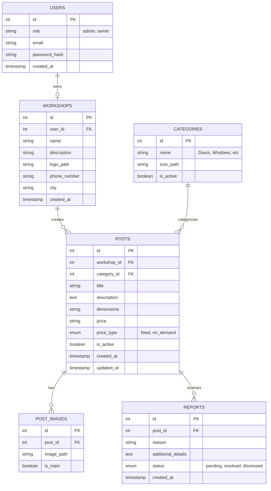

# Database Design

The database is designed to be *Normalized* (free of data duplication) and scalable for the future.

## Entity Relationship Diagram (ERD)

## Tables and Details

### 1. `users` Table

Stores login credentials for partners (admins and workshop owners). Regular customers do not have records as they are unregistered visitors.

* `id`: Primary Key.
* `role`: Determines the user type: 'admin' or 'owner'.
* `email`: Used for contact and login authentication (Unique).
* `password_hash`: Safely stores the password using Bcrypt.

### 2. `workshops` Table

Contains the Profile of each workshop which will be shown to visitors.

* `user_id`: Foreign Key from the `users` table. (One-to-One relationship).
* `city`: Text field (can be separated later into a `locations` table if needed).

### 3. `categories` Table

Types of blacksmith works (only the admin can add them).

* `id`: Primary Key.
* `name`: e.g., Doors, Handrails, Awnings...
* `is_active`: Soft delete mechanism to hide the category while keeping its historical posts.

### 4. `posts` Table (Works & Models)

The core of the platform, every post belongs to a specific workshop.

* `workshop_id`: Foreign Key linking the work to its owner.
* `category_id`: Foreign Key linking the work to a category.
* `price_type`: Choice between `fixed` or `on_demand`.
* `is_active`: Allows the workshop or admin to temporarily pause the visibility of the post.

### 5. `post_images` Table

Since a post can have multiple images, they shouldn't be in the post table directly.

* `post_id`: Foreign Key linking images to a post (One-to-Many).
* `is_main`: A boolean to indicate this is the main cover image shown on thumbnail cards.

### 6. `reports` Table

Stores reports submitted by visitors regarding bad content.

* `post_id`: The reported post.
* `status`: Report status ('pending' review, 'resolved' action taken, 'dismissed' false report).
