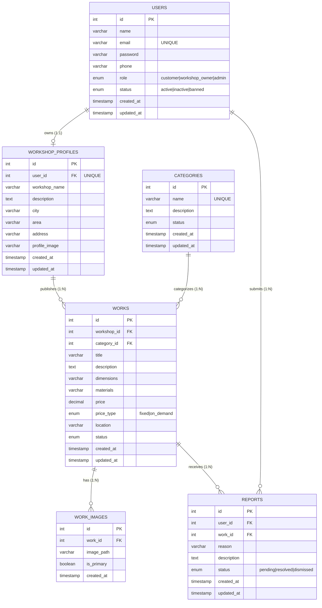

# Blacksmith Platform: Database Implementation Design

## 1. Use Case Diagram Verification

Before building the SQL structure, we confirmed that the database matches the **Use Case Diagram**:

* **Browse & Search:** Covered by the `works` and `categories` tables (Fields: `title`, `description`, `city` via the workshop join) which have appropriate indexes for rapid querying.
* **View Work / Contact:** Covered by joining `works`, `work_images`, and `workshop_profiles` (which includes contact `phone`).
* **Owner - Add/Edit Work:** Covered fully by `works` and `work_images` tables.
* **Owner / Customer - Login:** Covered by `users.role` allowing role-based authorization without duplicating authentication tables.
* **User Reports:** Covered by the `reports` table ensuring customers can submit feedback.
* **Admin Management:** Active/Inactive/Deleted `status` fields exist across users, categories, works, and reports for complete moderation capabilities without permanently losing data.

---

## 2. Complete Entity Relationship Diagram (ERD)

---

## 3. Database Schema Explanations

### 1. `users` Table

**Purpose:** Handles authentication and authorization for all actors (Admins, Owners, Customers) using a single centralized table to avoid data redundancy.

* **Keys:** `id` (PK)
* **Indexes:** `email` (Unique for login), `role` (For access control checks), `status`.
* **Security:** Stores hashed passwords, not plain text.

### 2. `workshop_profiles` Table

**Purpose:** Contains the public-facing business details for workshop owners. Separating this from the `users` table normalizes the database, as Admins and Customers do not need workshop-specific fields (like `workshop_name` or `city`).

* **Keys:** `id` (PK), `user_id` (FK to Users).
* **Constraints:** `user_id` is set to `UNIQUE` to strictly enforce the One-to-One relationship. `ON DELETE CASCADE` ensures that if a user deletes their account, their workshop profile is automatically obliterated.
* **Indexes:** `city` to speed up location-based filtering.

### 3. `categories` Table

**Purpose:** Stores the platform's metalwork classification (Doors, Windows).

* **Keys:** `id` (PK).
* **Constraint:** `name` is `UNIQUE` to prevent duplicated classifications.

### 4. `works` Table (Designs/Posts)

**Purpose:** The core entity of the platform storing the metalworks published by owners.

* **Keys:** `id` (PK).
* **Foreign Keys:**
  * `workshop_id` (FK to Workshop_Profiles): Identifying the authoritative owner. `ON DELETE CASCADE` (Deleting the workshop deletes all its works).
  * `category_id` (FK to Categories): `ON DELETE RESTRICT` protects against accidentally deleting a category that has attached works.
* **Optimization:** Indexes on `title`, `workshop_id`, `category_id`, and `status`, which are heavily used in Search and Filtering operations.

### 5. `work_images` Table

**Purpose:** Normalizes image storage. Instead of storing multiple images in a comma-separated string inside `works`, they are kept in a One-to-Many table.

* **Keys:** `id` (PK), `work_id` (FK).
* **Usage:** `is_primary` boolean makes it extremely fast to fetch the thumbnail for the listing gallery without joining excessive queries.

### 6. `reports` Table

**Purpose:** Allows logged-in Customers to flag inappropriate or inaccurate content. This links directly to the Moderation Use Cases for Admins.

* **Keys:** `id` (PK), `user_id` (FK - The reporter), `work_id` (FK - The reported post).
* **Constraints:** Both FKs cascade on delete. If a work is removed by the admin, its pending reports are automatically cleaned up.

---

## 4. Primary Keys, Foreign Keys, and Cascading Rules Summary

* **`users.id`** -> `workshop_profiles.user_id` (1:1) | **Rule:** CASCADE
* **`users.id`** -> `reports.user_id` (1:N) | **Rule:** CASCADE
* **`workshop_profiles.id`** -> `works.workshop_id` (1:N) | **Rule:** CASCADE
* **`categories.id`** -> `works.category_id` (1:N) | **Rule:** RESTRICT
* **`works.id`** -> `work_images.work_id` (1:N) | **Rule:** CASCADE
* **`works.id`** -> `reports.work_id` (1:N) | **Rule:** CASCADE
